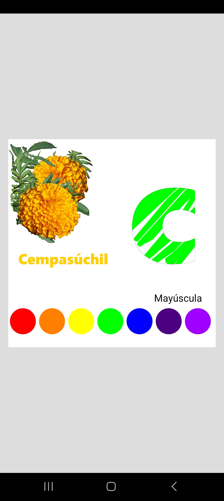

# Rellena letra de la A a la z

Al iniciarse el programa escoge una letra, muestra la mayúscula
con opciones de selección de color para el relleno al mover el
cursor sobre la letra; adicionalmente puede cambiar la mayúscula
a minúscula, donde, además, se muestra una flor cuyo nombre
inicia con dicha letra (aún no terminado).
